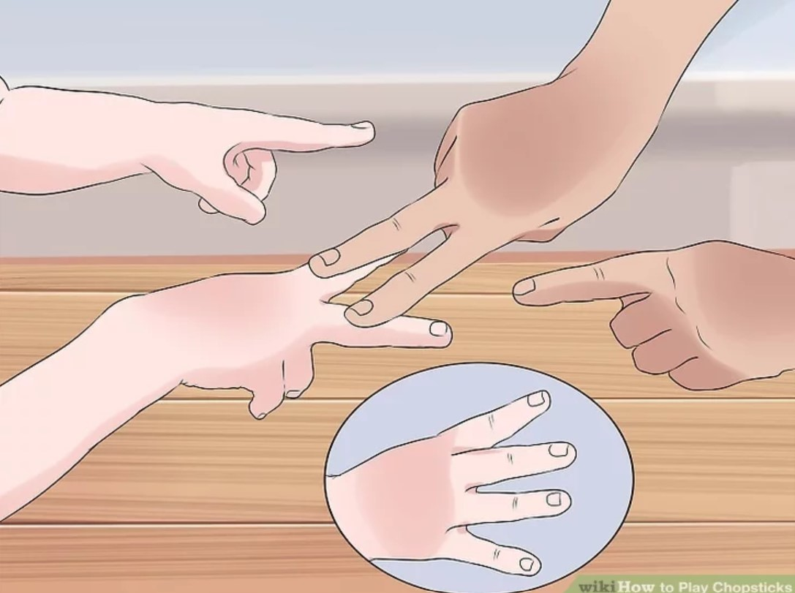
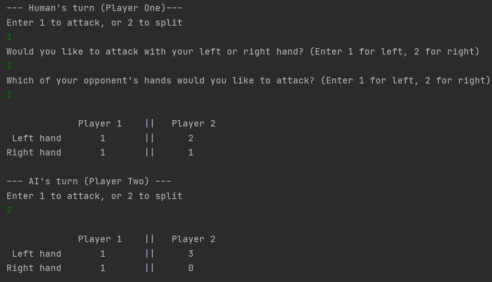

# The Chopsticks Hand Game

Source: [Wikihow](https://www.wikihow.com/Play-Chopsticks)
## The game

This program runs this popular kids' game and includes an
AI player to play against.

## The algorithm

The AI is implemented using the minimax algorithm with alpha-beta pruning.
You can select the search depth limit for the AI to control the depth that the AI
will search through the game tree to decide its move.

The evaluation function used to calculate the utility scores for this game is:

## The program
This program runs on Windows with C++20.
To start the game, run open a Visual Build Tools terminal, navigate to
this code's folder and then type the command `chopsticks`

## Demo

